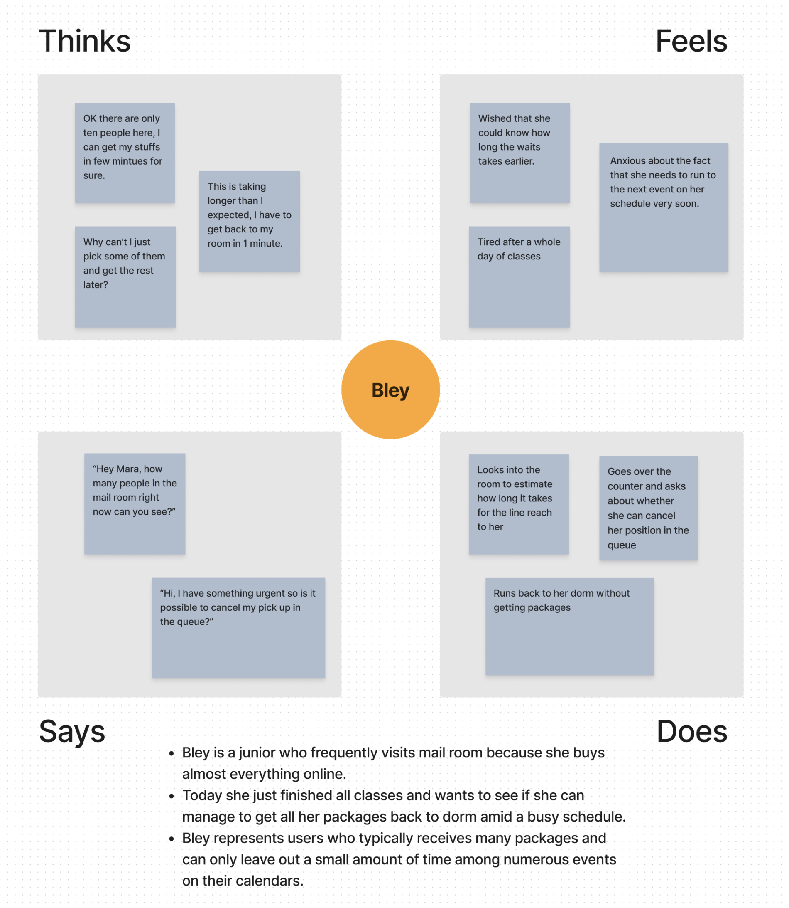

# Personas & Storyboarding

## Preparation

The interface I select is the mail&package retrieval kiosk at the door to Brown University Mail Services. There are two such kiosk located in front of the door with an instruction panel between them on how to use the system, and one inside the room of Mail Services.

Composed of a touchscreen and a card-swiper, this kiosk allows students to get their mails and packages by first swiping their ID cards to automatically detect their IDs. Then, the kiosk will show how many packages and mails belonged to students are at the Mail Service. Eventually students can choose whether they want to get them now and proceed to the room into the waiting queue, or exit and retrieve at a later point. 

For those who choose to wait in the line, when their names are called upon, they can walk to the counter and get mails and packages from the staff by swiping ID and signing. There is a TV playing pop music on the wall of the mail room. 

## Observations

The observation took place in the afternoon of a Friday, with approximately 20 people waiting in the mail room to retrieve their packages.

### *Notable Points*

1. 2 out 3 people failed to swipe in the right orientation of their ID for the first trial. They seemed to be a bit of pressured by the line behind them.
2. One person looked into the room for a few seconds before choosing "Cancel" and leaving the building, while the other two chose "Pick Up Now" and went to the room to wait.

3. Of the two people who stayed for their packages, one was wearing a headphone and thus did not hear the staff calling him until the staff' raised to a very loud voice.

### *Questions for the Users*

1. How do you decide to pick up your packages immediately or get them later?

   **Response:** There are mainly two criteria involved. One is the amount of mails and packages. If there are too many the responders choose to come back at a later time to prepare carrying them away all in once. The other is the expected time needed to wait in the line, usually estimated by checking the number of people in the room. Upon further inquiry, responders indicated that such estimation is not very reliable, for the actual time frequently varies. 

2. Are you satisfied with the design of the kiosk?

   **Response:** Responders are generally satisfied with the efficency of kiosk in adding them to the queue, mentioning that first time using it could be very confusing. They hope that the right orientaion of ID swiping could be more clearly indicated, however.

3. What do you think of the waiting queue?

   **Response**: Responders wish they could spent less time on waiting but recognize that as a difficult-to-change issue. They note that they cannot fully relax for their names may be called at moment. The music by the TV also gets mentioned as a disturbing factor. They hope there can be more benches to sit in the room. 

## Personas

## Storyboards

> (not sure if this is necessary) citation:  the storyboard is created with Canvas, while the HTML output is generated by Typora